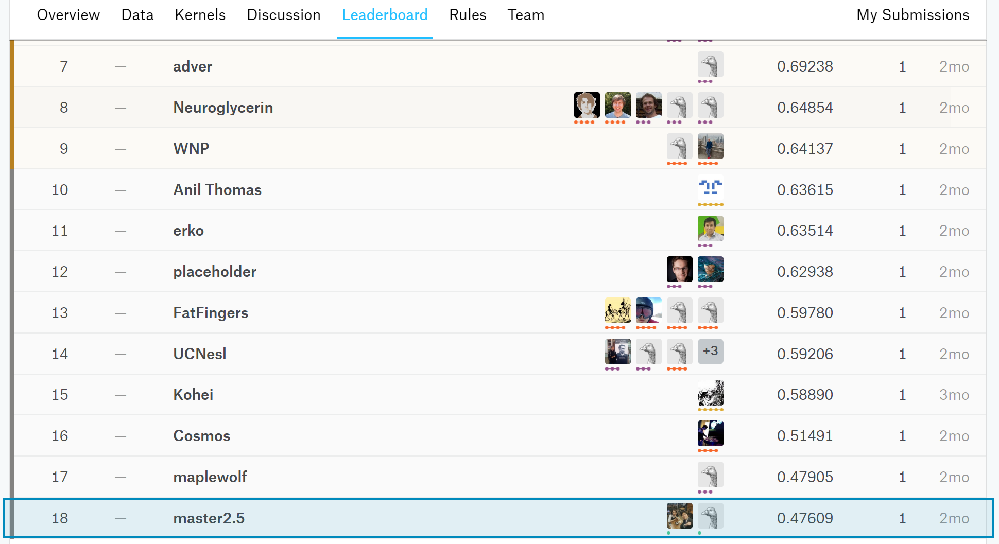
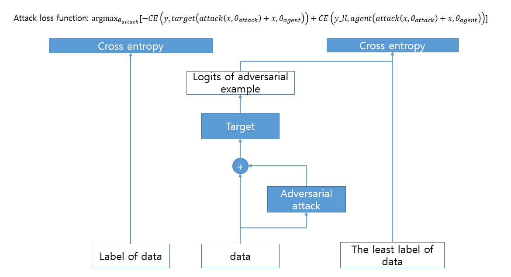
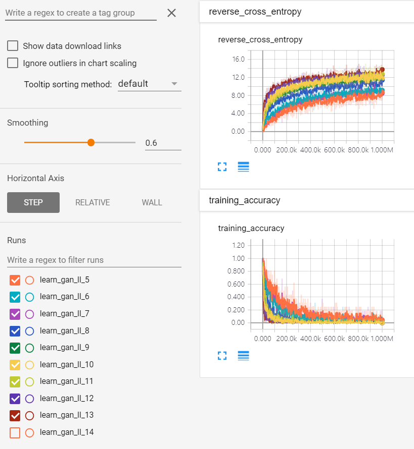

NIPS 2017 Defense Against Adversarial Attack (18th place)
===============

https://www.kaggle.com/c/nips-2017-defense-against-adversarial-attack

Baseline Algorithms
---------------

### Fast Gradient Sign Method

Fast Gradient Sign Method is to generate adversarial images with gradient information of loss for the image.

https://arxiv.org/pdf/1607.02533.pdf

Run script file in sample_attack folder as followed.

`
./run_attack.sh
`

This module is based on sample attack codes from Google Brain.

### Iterative Least-likely Class Method

Iterative Least-likely Class Method is to generate adversarial images by not using true label but "least-likely" label.

https://arxiv.org/pdf/1607.02533.pdf

Run script file in iter_llcm folder as followed.

`
./run_attack.sh
`

This module is based on gongzhitaao's git and sample attack codes from Google Brain.

https://github.com/gongzhitaao/tensorflow-adversarial

(Proposed) Adversarial Attack based on adversarial generative learning
----------------------------

This module is to learn a functionality generating adversairal noise can make the model mis-predict data added with that as followed.

We designed and validated lots of variations which are summarized bellowed table.

The source code name is 

`
mark[1-3]_<target_model_num>_[notavg,avg,avg2].py.
`

In there files, avg and avg2 mean ensemble after and before softmax, because TF supports one API, which is for softmax and cross-entropy simultaneously and shows a great performance, thus, we tried both of using that and not using that. "notavg" means design of loss function with cross-entropy functions for each target model.
 

|      |noise value range     |loss function                                              |batch_normalization|deconv model structure|
|------|----------------------|-----------------------------------------------------------|-------------------|----------------------|
|mark1 |-max_eps,0 and max_eps|reverse Cross-Entropy                                      |not used           |conv3-fc1-deconv3     |
|mark2 |[-max_eps,max_eps]    |reverse Cross-Entropy                                      |not used           |conv3-fc1-deconv3     |
|mark3 |[-max_eps,max_eps]    |reverse Cross-Entropy and the Cross-Entropy for least label|used               |conv3-fc1-deconv3     |

Reverse Cross-Entropy and training accuracy on learning of mark3

Results
--------

### Comparison Result Summary ((!) means black-box validation, max_epsilon is fixed as 10)

|                                                   | inception v3 | resnet v2 50 | inception v4 | inception resnet v2 | resnet v2 101 | resnet v2 152 | inception v1 | inception v2 | vgg-16 | vgg-19 | resnet v1 50 | resnet v1 101 | resnet v1 152 |black-box vali. sum(incept. resnet v2, incept. v1/v2,vgg 16/19, resnet v1 50/101/152)|entire sum|
|---------------------------------------------------|--------------|--------------|--------------|---------------------|---------------|---------------|--------------|--------------|--------|--------|--------------|---------------|---------------|-------------------------------------------------------------------------------------|----------|
|fgsm                                               |           749|        (!)258|        (!)226|               (!)173|         (!)248|         (!)245|        (!)300|        (!)238|  (!)343|  (!)356|        (!)487|         (!)270|         (!)255|                                                                                 2422|      4148|
|mark2 with incept.v3                               |           941|        (!)473|        (!)616|               (!)251|         (!)467|         (!)428|        (!)473|        (!)535|  (!)654|  (!)618|        (!)808|         (!)524|         (!)516|                                                                                 4379|      7304|
|mark2 with incept.v3 and res.v2_50                 |           949|           641|        (!)609|               (!)279|         (!)443|         (!)422|        (!)450|        (!)635|  (!)650|  (!)629|        (!)874|         (!)567|         (!)576|                                                                                 4660|      7724|
|mark2 with incept.v3 and res.v2 50/152             |           936|           636|        (!)605|               (!)280|         (!)472|            570|        (!)458|        (!)567|  (!)693|  (!)650|        (!)799|         (!)536|         (!)544|                                                                                 4527|      7746|
|mark2 with incept.v3/4 and res.v2 50/152/101       |           932|           564|           600|               (!)349|            528|            495|        (!)473|        (!)597|  (!)655|  (!)642|        (!)821|         (!)525|         (!)551|                                                                                 4613|      7732|
|mark2 with incept.v3/4,res.v2 50/152/101 and avg   |           970|           621|           631|               (!)257|            618|            559|        (!)519|        (!)603|  (!)673|  (!)658|        (!)866|         (!)571|         (!)580|                                                                                 4727|      8126|
|mark2 with incept.v3/4,res.v2 50/152/101 and avg2  |           815|           760|           786|               (!)234|            770|            739|        (!)626|        (!)735|  (!)681|  (!)675|        (!)880|         (!)649|         (!)649|                                                                                 5129|      8999|
|mark2 with incept.v3,res.v2 50/152 and avg2        |           854|           814|        (!)585|               (!)272|         (!)613|            781|        (!)633|        (!)738|  (!)657|  (!)670|        (!)855|         (!)577|         (!)604|                                                                                 5006|      8653|
|mark2 with incept.v3,res.v2 50 and avg2            |           884|           824|        (!)605|               (!)235|         (!)631|         (!)565|        (!)604|        (!)661|  (!)665|  (!)652|        (!)813|         (!)577|         (!)583|                                                                                 4790|      8299|
|step l.l                                           |           751|        (!)258|        (!)221|               (!)163|         (!)241|         (!)241|        (!)302|        (!)236|  (!)342|  (!)352|        (!)490|         (!)262|         (!)249|                                                                                 2396|      4108|
|mark3 with incept.v3                               |           995|        (!)385|        (!)515|               (!)232|         (!)321|         (!)329|        (!)350|        (!)439|  (!)518|  (!)527|        (!)806|         (!)450|         (!)462|                                                                                3784|       6329| 
|mark3 with incept.v3/4,res.v2 50/152/101 and avg2  |           886|           873|           877|               (!)379|            862|            845|        (!)648|        (!)720|  (!)723|  (!)719|        (!)854|         (!)670|         (!)664|                                                                         **5377**|      **9720**|

### Result Summary

|                                                                           |  4  |  5  |  6  |  7  |  8  |  9  | 10 | 11 | 12 | 13 | 14 | 15 | 16 |  sum|
|---------------------------------------------------------------------------|-----|-----|-----|-----|-----|-----|----|----|----|----|----|----|----|-----|
|fgsm                                                                       |  780|  781|  773|  759|  762|  753| 748| 747| 739| 741| 740| 737| 733| 9793|
|random_noise                                                               |    0|    0|    0|    0|    0|    0|   0|   0|   0|   0|   0|   0|   0|    0|
|mark1 with incept.v3 learned only when max_eps is 4,8 and 12               |  512|  525|  528|  532|  765|  768| 772| 771| 837| 837| 837| 838| 838| 9360|
|mark1 with incept.v3 learned only when max_eps is 6,8,10,12 and 14         |  521|  571|  716|  753|  758|  777| 825| 831| 924| 935| 937| 940| 941|10429|
|mark1 with incept.v3 learned only when max_eps is 6,7,8,10,12,13,14 and 16 |  521|  629|  716|  753|  758|  777| 825| 831| 924| 935| 964| 966| 967|10566|
|mark1 with incept.v3 learned only when max_eps is 8                        |  298|  536|  716|  753|  765|  768| 772| 771| 772| 773| 778| 787| 791| 9280|
|mark1 with incept.v3 learned only when max_eps is 12                       |   96|  172|  289|  443|  636|  781| 825| 831| 837| 837| 837| 838| 838| 8260|
|mark2 with incept.v3/4,res.v2 50/152/101 and avg2 learned for every max_eps|  225|  459|  177|  201|  721|  799| 832| 884| 907| 925| 938| 951| 959| 8978|
|mark2 with incept.v3/4,res.v2 50/152/101 and avg2(9-16) + fgsm(<=8)        |  780|  781|  773|  759|  762|  799| 832| 884| 907| 925| 938| 951| 959|11050|
|step l.l                                                                   |  771|  776|  767|  759|  753|  749| 751| 748| 741| 743| 741| 735| 735| 9769|
|mark3 with incept.v3(4-8)                                                  |  894|  928|  960|  957|  982|  982| 982| 982| 982| 982| 982| 982| 982|**12577**|

Authors
------------

Jaesik Yoon (jaesik817@gmail.com)

Hoyong Jang (hoyong.jang@kaist.ac.kr)

Talk Materials and Video (In Korean)
------------

https://www.slideshare.net/NaverEngineering/ss-86897066

https://youtu.be/76-Zuskj03c

